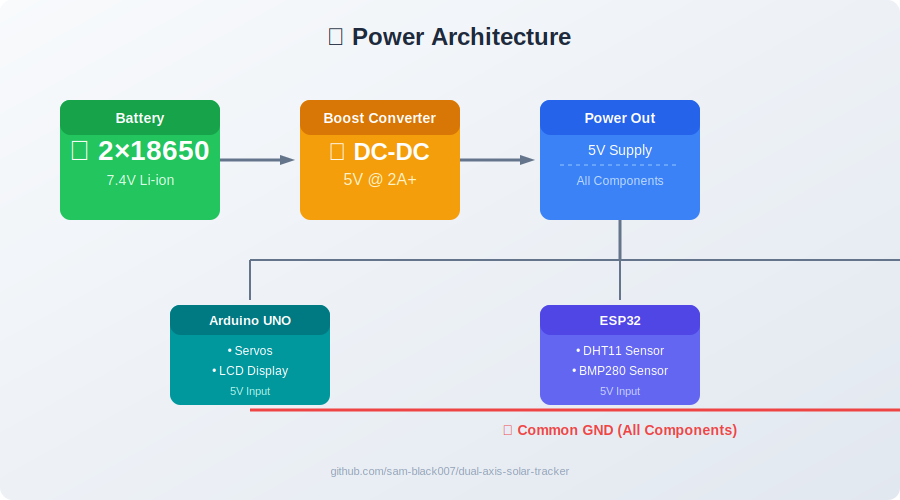
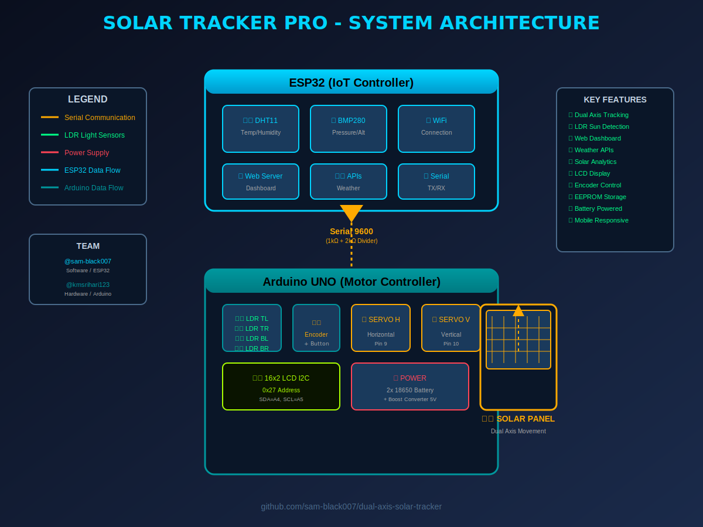
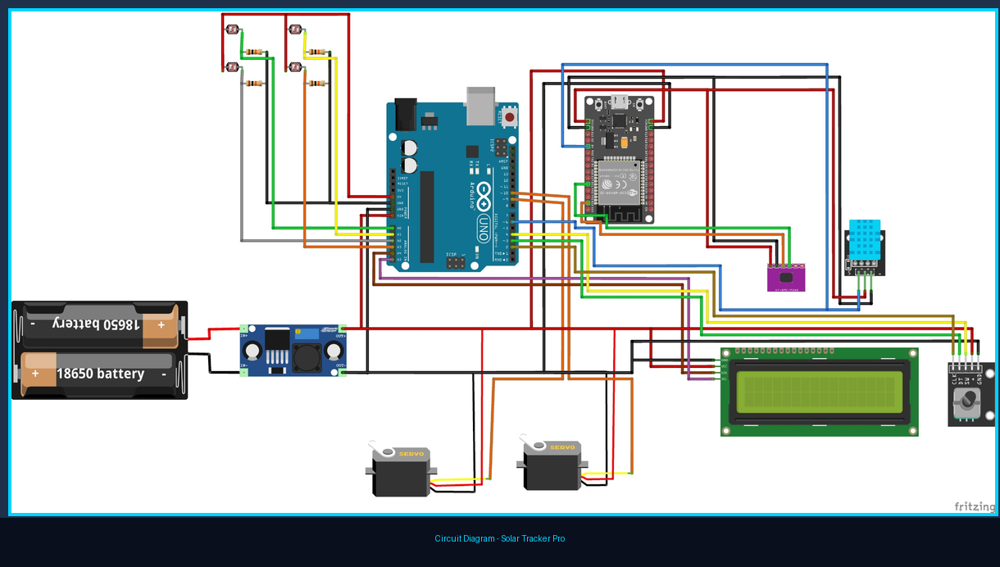

# ☀️ Dual Axis Solar Tracker Pro

A professional-grade dual-axis solar tracking system with real-time web dashboard, weather integration, and solar energy analytics. Tracks the sun throughout the day to maximize solar panel efficiency.


---

## 👥 Team

| Contributor | Role | GitHub |
|-------------|------|--------|
| **Sam Joseph** | Software Development, UX/UI Design, ESP32 Coding | [@sam-black007](https://github.com/sam-black007) |
| **K M Sri Hari** | Hardware Design, Circuit Implementation, Arduino UNO Coding | [@kmsrihari123](https://github.com/kmsrihari123) |

---

## 🔧 System Overview

This is a multi-sensor autonomous control system built around two microcontrollers working together:

### Core Components
| Controller | Primary Function |
|------------|----------------|
| **Arduino Uno** | Sensor data acquisition, Servo control, LCD interface |
| **ESP32** | WiFi/IoT communication, Web server, Cloud interface |

### Sensors Integrated
| Sensor | Purpose |
|--------|---------|
| **4× LDR Sensors** | Light sensing for solar tracking |
| **DHT11** | Temperature & Humidity monitoring |
| **BMP280** | Pressure & Altitude (via ESP32) |

### Power System
- **2× 18650 Li-ion batteries** (rechargeable)
- **DC-DC Boost Converter** (step-up module)
- **Common GND** across all components

---

## ⚡ Power Architecture



---

## 🏗️ System Architecture



---

## 🔌 Circuit Diagram



---

## 📦 Hardware Requirements

### Power System
| Component | Specification | Quantity |
|-----------|---------------|----------|
| 18650 Battery | 3.7V Li-ion | 2 |
| DC-DC Boost Converter | 5V output | 1 |

### Controllers
| Component | Specification | Quantity |
|-----------|---------------|----------|
| Arduino Uno/Nano | Main controller | 1 |
| ESP32 Dev Board | IoT/WiFi module | 1 |

### Sensors
| Component | Specification | Quantity |
|-----------|---------------|----------|
| LDR | GL5528 or similar | 4 |
| DHT11 | Temperature & Humidity | 1 |
| BMP280 | Pressure & Altitude (I2C) | 1 |

### Actuators & Display
| Component | Specification | Quantity |
|-----------|---------------|----------|
| Servo Motor | MG996R or similar | 2 |
| 16x2 I2C LCD | Address 0x27 | 1 |
| Rotary Encoder | With push button | 1 |

### Passive Components
| Component | Specification | Quantity |
|-----------|---------------|----------|
| 10kΩ Resistor | LDR pull-down | 4 |
| 1kΩ Resistor | Voltage divider | 2 |
| 2kΩ Resistor | Voltage divider | 2 |

---

## 🔌 Pin Connections

### ESP32
```
GPIO 4    → DHT11 DATA
GPIO 21   → BMP280 SDA (I2C)
GPIO 22   → BMP280 SCL (I2C)
GPIO 16   → Arduino TX (Serial2 RX)
GPIO 17   → Arduino RX (Serial2 TX)
           ⚠️ Use 1kΩ + 2kΩ voltage divider for 5V → 3.3V
3.3V      → DHT11 VCC, BMP280 VCC
GND       → Common Ground
```

### Arduino UNO
```
PWM OUTPUT PINS:
Pin 9     → Servo Horizontal Signal
Pin 10    → Servo Vertical Signal

ANALOG INPUTS:
A0        → LDR Top Left (via 10kΩ to GND)
A1        → LDR Top Right (via 10kΩ to GND)
A2        → LDR Bottom Left (via 10kΩ to GND)
A3        → LDR Bottom Right (via 10kΩ to GND)
A4        → LCD SDA (I2C)
A5        → LCD SCL (I2C)

DIGITAL PINS:
Pin 2     → Rotary Encoder CLK
Pin 3     → Rotary Encoder DT
Pin 4     → Push Button (INPUT_PULLUP)
Pin 1     → ESP32 TX (via voltage divider)
Pin 0     → ESP32 RX

POWER:
5V        → Servo VCC, LCD VCC
GND       → Common Ground (ALL components)
```

### LDR Connection Diagram
```
VCC ──────┬─────┬─────┬─────┐
          │     │     │     │
         LDR   LDR   LDR   LDR
          │     │     │     │
         A0    A1    A2    A3
          │     │     │     │
         10k   10k   10k   10k
          │     │     │     │
         GND   GND   GND   GND
```

---

## 🔄 System Logic Flow

```
┌─────────────────────────────────────────────────────────────────────┐
│                         OPERATIONAL FLOW                             │
├─────────────────────────────────────────────────────────────────────┤
│                                                                      │
│  1. LDR SENSORS ──▶ Detect light direction                        │
│         │                                                           │
│         ▼                                                           │
│  2. ARDUINO ────▶ Process light differential                      │
│         │                                                           │
│         ▼                                                           │
│  3. SERVOS ─────▶ Move panel toward sun                            │
│         │                                                           │
│         ▼                                                           │
│  4. SENSORS ────▶ Collect environment data                          │
│     (DHT11)                                                        │
│         │                                                           │
│         ▼                                                           │
│  5. LCD ─────────▶ Display readings                                 │
│         │                                                           │
│         ▼                                                           │
│  6. SERIAL ─────▶ Send data to ESP32                              │
│         │                                                           │
│         ▼                                                           │
│  7. ESP32 ──────▶ Upload to web dashboard                          │
│                                                                      │
└─────────────────────────────────────────────────────────────────────┘
```

---

## 🌟 Features

### Hardware Control
- **Dual Axis Tracking** - Independent horizontal (azimuth) and vertical (elevation) servo control
- **LDR Sensor Array** - 4 Light Dependent Resistors for precise sun position detection
- **Real-time Servo Feedback** - Position monitoring and smooth movement control
- **EEPROM Storage** - Persistent home position and settings across reboots

### Web Dashboard (ESP32)
- **Live Sensor Data** - Temperature, humidity, pressure, altitude
- **Solar Energy Analytics** - Irradiance, power output, energy generated, carbon savings
- **OpenWeatherMap Integration** - Real-time weather conditions and forecasts
- **Manual Control** - Adjust panel position from any browser
- **Responsive Design** - Works on desktop, tablet, and mobile

### Display & Controls
- **16x2 I2C LCD** - Local status display without WiFi
- **Rotary Encoder** - Menu navigation and manual adjustment
- **Physical Button** - Mode switching and menu control
- **Multiple Operating Modes** - Auto tracking, manual, demo, presets, custom paths

### Safety Features
- **Axis Flip Option** - Compensate for LDR mounting orientation
- **Angle Limits** - Configurable min/max positions
- **Smooth Movement** - Configurable servo speed to protect mechanics

---

## 💻 Technologies Used

### Why This Tech Stack?

| Technology | Why We Used It | Alternative |
|------------|----------------|--------------|
| **ESP32** | Built-in WiFi, Dual-core, WebServer capability, More analog pins than typical MCUs | Raspberry Pi Pico W (more expensive) |
| **Arduino UNO** | Precise PWM for servos, More stable timing for real-time control, 6+ analog inputs for sensors | ESP32 alone (but lacks stable PWM timing) |
| **C++ (Arduino)** | Best for hardware-level control, Direct register access, Low memory footprint | Python (too slow for real-time servo control) |
| **HTML/CSS/JS** | Embedded in ESP32, No separate hosting needed, Works on any device with browser | React/Vue (too heavy for ESP32) |
| **DHT11 + BMP280** | Low cost, Reliable, Well-documented libraries | BME280 (more expensive) |

### Architecture Decision: Why Two Boards?

```
┌─────────────────────────────────────────────────────────────────┐
│              WHY ESP32 + ARDUINO (NOT ONE BOARD)?                │
├─────────────────────────────────────────────────────────────────┤
│                                                                  │
│  ┌─────────────────────┐    ┌─────────────────────┐           │
│  │     ESP32 ALONE     │    │    ARDUINO ALONE    │           │
│  ├─────────────────────┤    ├─────────────────────┤           │
│  │ ✗ Only 1 ADC pin   │    │ ✗ No WiFi built-in │           │
│  │ ✗ PWM timing issues│    │ ✗ Can't host web   │           │
│  │ ✗ I2C conflicts   │    │ ✗ Limited memory   │           │
│  └─────────────────────┘    └─────────────────────┘           │
│                                                                  │
│  ┌─────────────────────────────────────────────────────┐       │
│  │              ESP32 + ARDUINO (OUR SOLUTION)         │       │
│  ├─────────────────────────────────────────────────────┤       │
│  │ ✓ ESP32: WiFi, Web Server, Weather APIs, Dashboard  │       │
│  │ ✓ Arduino: Precise servo control, More ADC pins    │       │
│  │ ✓ Best of both worlds                              │       │
│  └─────────────────────────────────────────────────────┘       │
└─────────────────────────────────────────────────────────────────┘
```

---

## 💻 Software Setup

### Required Libraries

**ESP32 (install via Arduino Library Manager):**
- `Adafruit BMP280` by Adafruit
- `DHT sensor library` by Adafruit

**Arduino UNO (install via Arduino Library Manager):**
- `LiquidCrystal I2C` by Frank de Brabander
- `Encoder` by Paul Stoffregen

### Configuration

**ESP32 Code (`esp32_solar_tracker.ino`):**
```cpp
// Update your WiFi credentials
const char* WIFI_SSID     = "YourWiFiName";
const char* WIFI_PASSWORD = "YourWiFiPassword";

// Get free API key from openweathermap.org
const char* OWM_API_KEY   = "your_api_key_here";

// Set your location
#define LATITUDE  "13.0827"   // Chennai example
#define LONGITUDE "80.2707"
```

**Arduino Code (`arduino_solar_tracker.ino`):**
```cpp
// Adjust home position for your setup
int homeH = 175;  // Horizontal home angle
int homeV = 5;    // Vertical home angle
```

### Upload
1. Upload ESP32 code to ESP32 board
2. Upload Arduino code to Arduino UNO/Nano
3. Open Serial Monitor (115200 baud for ESP32, 9600 for Arduino)
4. Note the IP address shown on LCD or Serial
5. Open browser: `http://<ESP32_IP>`

---

## 🎮 Operating Modes

### Auto Mode (Default)
- LDR sensors continuously monitor light intensity
- Panel automatically adjusts to follow the brightest point
- Relay calculations optimize for maximum sun exposure

### Manual Mode
- Use web dashboard sliders or physical encoder
- Fine-tune panel position for specific needs
- Set custom home position

### Demo Mode
- Showcase system capabilities
- H-only, V-only, or combined sweep
- Useful for testing and demonstrations

### Preset Mode
- Pre-configured sun positions for different times
- Morning, Forenoon, Noon, Afternoon, Evening, Night
- Automatically returns home after each preset

### Custom Path Mode
- Define up to 5 custom waypoints
- Create personalized tracking patterns
- 3-second dwell time at each waypoint

---

## 🌤️ Web Dashboard Features

### Live Sensors Panel
- Temperature (DHT11)
- Humidity (DHT11)
- Pressure (BMP280)
- Altitude (BMP280)
- Heat Index calculation
- Dew Point calculation

### Solar Energy Panel
- Irradiance (W/m²)
- Panel Power (W)
- Peak Power tracking
- Daily Energy (Wh)
- Carbon Savings (g CO2)
- UV Index

### OpenWeatherMap Panel
- Current temperature
- Wind speed and direction
- Weather condition
- Cloud cover percentage
- Precipitation

### Tracker Control
- Current horizontal/vertical angle
- Visual position indicator
- Flip axis buttons (for LDR orientation)
- Manual angle sliders

---

## 📡 Serial Communication Protocol

### ESP32 → Arduino Commands
| Command | Description |
|---------|-------------|
| `SH:90` | Set horizontal angle to 90° |
| `SV:45` | Set vertical angle to 45° |
| `SPD:8` | Set movement speed (2-50ms) |
| `HOME` | Return to home position |
| `SETHOME:175,5` | Save new home position |
| `FLIP:H` | Toggle horizontal axis flip |
| `MODE:AUTO` | Switch to auto tracking mode |
| `PRESET:2` | Move to preset position 2 |

### Arduino → ESP32 Data
| Data | Description |
|------|-------------|
| `LDR:512,520,480,490` | LDR sensor values |
| `POS:90,45` | Current servo positions |
| `TEMP:28.5,HUM:65,P:1013` | Environment data |
| `LCD:Line1\|Line2` | LCD display content |
| `WIFI:192.168.1.100` | WiFi connection status |

---

## 🛡️ Safety Guidelines

> **⚠️ This project involves electrical systems and mechanical components.**
>
> ### Power Safety
> - Use proper 18650 battery holders with protection circuits
> - Ensure boost converter output is stable at 5V
> - Never reverse battery polarity
>
> ### Electrical Safety
> - Use voltage dividers for 5V to 3.3V level shifting (Arduino TX → ESP32 RX)
> - Common GND must be shared across ALL components
> - Servos should ideally have SEPARATE power supply (current spikes)
>
> ### Mechanical Safety
> - Secure all connections to prevent accidental disconnects
> - Keep moving parts away from children and pets
> - Use appropriate enclosures for outdoor installations
>
> ### Battery Safety
> - Use protected 18650 cells with built-in overcharge/overdischarge protection
> - Never short circuit battery terminals
> - Charge batteries in a safe location away from flammable materials

---

## 🔧 Troubleshooting

| Problem | Solution |
|---------|---------|
| ESP32 won't connect to WiFi | Check SSID/password, ensure 2.4GHz network |
| LDR sensors not working | Verify 10kΩ resistors are connected to GND |
| Servos not moving | Check power supply (needs 5V, 2A+), verify signal connections |
| LCD not displaying | Check I2C address (default 0x27), adjust contrast potentiometer |
| Web dashboard not loading | Verify ESP32 IP address, check WiFi connectivity |
| Serial communication failing | Use voltage divider for TX/RX lines (5V→3.3V) |
| Batteries draining quickly | Add separate power for servos, check boost converter efficiency |

---

## 📁 Project Structure

```
solar-tracker/
├── esp32_solar_tracker.ino     # ESP32 IoT controller (Web dashboard, WiFi, APIs)
├── arduino_solar_tracker.ino   # Arduino motor controller (Servos, LDR, LCD)
├── images/
│   ├── system_architecture.png  # System architecture diagram
│   └── circuit_diagram.png      # Circuit wiring diagram
├── README.md                    # Documentation
└── LICENSE                      # MIT License
```

---

## 📈 Performance Calculations

The system calculates various solar metrics:

| Metric | Formula | Description |
|--------|---------|-------------|
| Irradiance | (LDR_avg / 1023) × 1000 | Solar radiation (W/m²) |
| Power | Irradiance × 0.5 × 0.18 | Panel output (W) |
| Panel Efficiency | 18% × (1 - 0.4% × (Temp - 25)) | Temperature-adjusted |
| Performance Ratio | Actual / Theoretical × 100% | System efficiency |
| Carbon Saved | Energy_Wh / 1000 × 820 | g CO2 avoided |
| UV Index | (Irradiance / 1000) × 12 × Cloud_Factor | UV exposure level |

---

## 🚀 Future Enhancements

- [ ] OTA firmware updates
- [ ] MQTT integration for home automation
- [ ] Weather-based predictive tracking
- [ ] SD card data logging
- [ ] GPS module for automatic location
- [ ] Mobile app notification alerts
- [ ] Solar angle calculations based on date/time
- [ ] Battery level monitoring
- [ ] Automatic sleep/wake cycles

---

## 📄 License

This project is released under the MIT License - see [LICENSE](LICENSE) file for details.

---

## 👥 Authors

| Name | GitHub | Contributions |
|------|--------|---------------|
| **Sam Joseph** | [@sam-black007](https://github.com/sam-black007) | Software Development, ESP32 Coding, Web Dashboard UX/UI |
| **K M Sri Hari** | [@kmsrihari123](https://github.com/kmsrihari123) | Hardware Design, Circuit Implementation, Arduino UNO Coding |

---

*Built for sustainable energy. Maximize your solar potential.*
